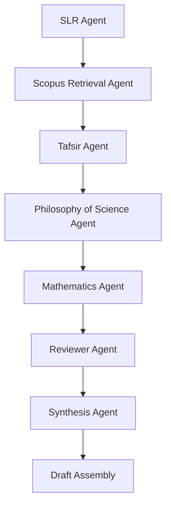

# Agent Pipeline

This document defines the working order for the paper on `Epistemic Type-Constraint Model`.

The rule is simple: each agent owns one lane, and the paper moves forward only when the current lane has produced a usable artifact.

## High-level flow

## Phase 0. Corpus building

### Owner
- `Agen SLR`
- `Agen Scopus Retrieval`

### Purpose
Build the literature base before any serious drafting.

### Inputs
- Research question
- Paper theme
- English-only corpus rule
- Search axes in `references/slr.md`

### Output
- Verified paper list
- Core / supporting / optional tags
- Metadata: title, venue, year, DOI, access path, relevance note

### Gate
Do not start the body draft until the corpus has at least:
- direct scientific exegesis sources,
- direct critique sources,
- formal epistemology sources,
- philosophy of science sources.

## Phase 1. Tafsir layer

### Owner
- `Agen Tafsir`

### Purpose
Test the paper's Qur'anic and hermeneutic claims.

### Questions
- Is `Q` really being treated as mutawatir text?
- Is `Ti(Q)` actually distinguishable from the text itself?
- When is a reading `qath'i al-dalalah`, and when is it still nazhari?
- Does the argument avoid cocoklogi?

### Output
- Tafsir validity verdict
- Boundary conditions for revision
- A list of weak or overextended readings

### Gate
The paper cannot move on unless the tafsir layer is explicit about:
- what is fixed,
- what is revisable,
- and what counts as a legitimate interpretation.

## Phase 2. Philosophy of science layer

### Owner
- `Agen Filsafat Sains`

### Purpose
Separate data, model, inference, and ontology.

### Questions
- What is data?
- What is a scientific model?
- What does the theory actually claim?
- Is the paper over-attributing certainty to science?
- Is the conflict really between science and text, or science and interpretation?

### Output
- Epistemic map of the scientific side
- Conflict classification
- Warnings about overclaiming on the science side

### Gate
The paper must explicitly distinguish:
- empirical data,
- scientific models,
- interpretive claims,
- and ontological claims.

## Phase 3. Formalization layer

### Owner
- `Agen Matematika`

### Purpose
Turn the conceptual model into a clean formal structure.

### Required objects
- `Q`
- `Ti(Q)`
- `D`
- `Mj(D)`
- `Conflict`
- `constraint`
- `revision`
- `diagnosis`

### Output
- Formal definitions
- Constraint set
- Revision rule
- Diagnostics rule
- Any pseudocode or pipeline notation

### Gate
The formal layer must be usable, not decorative.
If a symbol cannot be defined cleanly, it stays out.

## Phase 4. Review stress test

### Owner
- `Agen Reviewer Jurnal`

### Purpose
Attack the paper like a hard journal reviewer.

### Questions
- What would get rejected immediately?
- Where is the novelty claim weak?
- Where are the definitions still soft?
- What is still hand-wavy?
- What needs a worked example?

### Output
- Rejection-risk list
- Revision priorities
- Minimum publishability threshold

### Gate
Nothing enters final synthesis until the reviewer has marked the main weak points.

## Phase 5. Synthesis

### Owner
- `Agen Sintesis`

### Purpose
Merge all validated outputs into one paper direction.

### Responsibilities
- Resolve conflicts between agents
- Keep only claims that survived review
- Keep the thesis sharp
- Remove duplicated or inflated claims

### Output
- Final paper outline
- Ordered argument sequence
- Section-by-section draft plan

### Gate
Synthesis must not invent new claims.
It only combines what the other agents have already justified.

## Draft assembly order

1. Problem statement
2. Tafsir boundary
3. Science boundary
4. Formal model
5. Worked example
6. Discussion
7. Limitations
8. Conclusion

## Draft rule

The draft is ready only when all of these are true:
- corpus is verified,
- tafsir boundary is stable,
- science boundary is stable,
- formal definitions are explicit,
- reviewer risks are addressed,
- synthesis gives one coherent thesis.

## Operational rule

If any later phase exposes a flaw in an earlier phase, the paper returns to that earlier phase.

No phase is final until the whole chain holds together.
